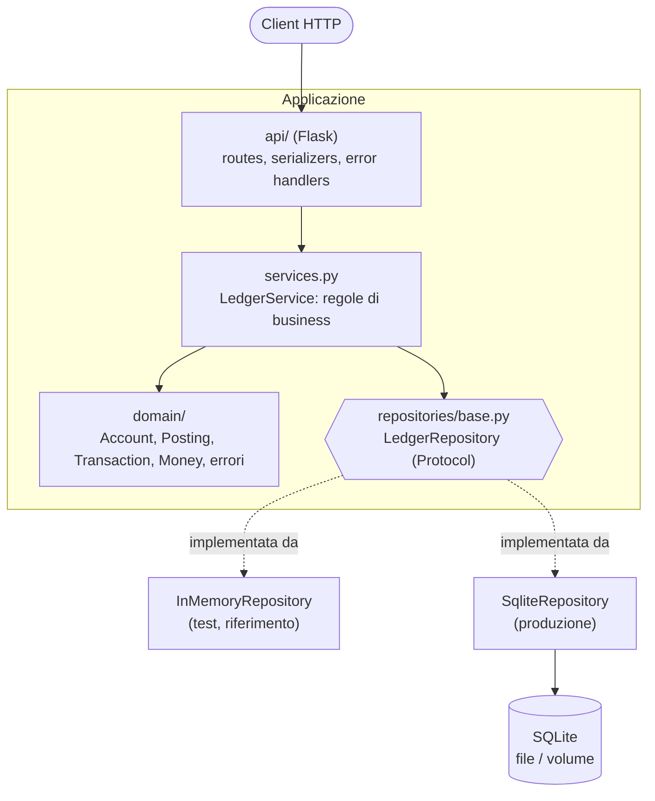
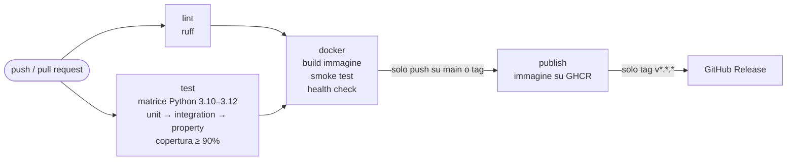

# Architettura

## Struttura a strati

| Strato | Responsabilità | Dipendenze |
|---|---|---|
| `domain/` | Entità immutabili e validazione strutturale (T1–T3); nessun I/O. | solo libreria standard |
| `services.py` | Regole che richiedono lo stato (T4, T5, T7, R1–R4, A3) e report (B1, B2, S1). | dominio + porta repository |
| `repositories/` | Persistenza. Porta (`Protocol`) + 2 adattatori con **lo stesso contratto**. | dominio |
| `api/` | Traduzione JSON ⇄ dominio, mappa errori → HTTP. | Flask |

Le dipendenze puntano verso l'interno: il dominio non conosce Flask né SQLite, quindi si testa senza infrastruttura.

## Decisioni di progetto

1. **Importi come interi in centesimi.** Nessun errore di arrotondamento; sul filo sono stringhe decimali.
2. **Libro mastro append-only.** Gli errori si correggono con storni, come in contabilità reale: lo storico è sempre verificabile.
3. **Difesa in profondità.** Gli invarianti sono controllati dal dominio *e* dallo schema SQL.
4. **Porta/adattatori per il repository.** Permette test unitari veloci con il backend in memoria e test di integrazione con
   SQLite reale; una *contract test suite* garantisce che i due backend siano intercambiabili.
5. **Idempotenza con `Idempotency-Key`.** I client possono ritentare in sicurezza dopo un timeout; il vincolo `UNIQUE` nel DB
   protegge anche dalle corse tra richieste parallele.
6. **SQLite con modalità WAL e `BEGIN IMMEDIATE`.** Più processi gunicorn possono scrivere sullo stesso file senza
   corrompere i dati; ogni scrittura è atomica.
7. **Solo libreria standard + Flask a runtime.** Superficie di dipendenze ridotta, immagine piccola.
8. **"Oggi" in UTC.** Scelta esplicita e documentata; un deployment con fusi orari diversi richiederebbe di rendere configurabile il clock.

## Pipeline CI/CD (`.github/workflows/ci.yml`)

- **CI** (ogni push e pull request): lint, test su tre versioni di Python con misura di copertura (soglia 90 %, report
  XML/HTML come artefatto), build del container e smoke test end-to-end sul container reale.
- **CD** (solo su `main` e tag): pubblicazione dell'immagine su GitHub Container Registry con tag `latest`, versione
  semantica e SHA; sui tag `vX.Y.Z` viene creata anche una GitHub Release con note generate.
- **Deployment**: `docker compose pull && docker compose up -d` (vedi `docker-compose.yml`) su qualunque host con Docker;
  i dati stanno nel volume `ledger-data`.
