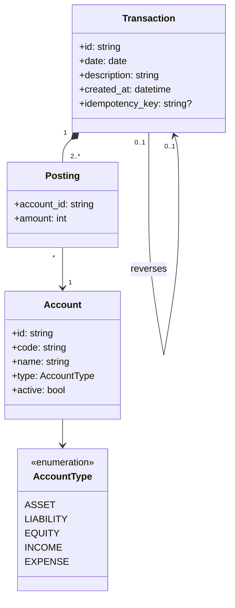

# Specifica di LedgerLite

Documento di specifica (parziale ma rigorosa) del servizio. Ogni regola ha un identificativo (`A1`, `T3`, `R2`…)
citato nel codice (`src/ledgerlite/services.py`) e nei test: la tabella di tracciabilità in fondo mostra
quale test verifica quale regola.

## 1. Scopo e ambito

LedgerLite è un servizio di **contabilità a partita doppia** esposto come API REST. Permette di:

- definire un piano dei conti (conti di tipo attività, passività, patrimonio netto, ricavi, costi);
- registrare **scritture** (transazioni) sempre bilanciate, in modo **idempotente**;
- **stornare** una scrittura sbagliata (il libro mastro è append-only: non si modifica né si cancella nulla);
- interrogare **saldi**, **estratti conto** (con saldo progressivo) e il **bilancio di verifica**.

Fuori ambito: multi-valuta, autenticazione, chiusura di periodo, UI.

## 2. Glossario

| Termine | Significato |
|---|---|
| Conto (*account*) | Contenitore di movimenti, con codice univoco e tipo. |
| Movimento (*posting*) | Singola riga di una scrittura: un conto e un importo con segno. |
| Scrittura (*transaction*) | Insieme immutabile e bilanciato di movimenti, con data e descrizione. |
| Dare / Avere (*debit / credit*) | I due lati di un movimento. |
| Lato normale | Lato su cui il saldo di un conto cresce: dare per attività e costi, avere per passività, patrimonio netto e ricavi. |
| Storno (*reversal*) | Scrittura che annulla esattamente un'altra scrittura. |

## 3. Modello di dominio

### Convenzioni

- **Importi**: interi in centesimi (mai `float`). Sull'API sono stringhe decimali (`"12.50"`, massimo 2 decimali,
  massimo 11 cifre intere).
- **Segno interno**: `amount = dare − avere`. Dare > 0, avere < 0. Sull'API ogni movimento ha `side` (`debit`/`credit`)
  e un `amount` strettamente positivo.
- **Date**: ISO-8601 (`YYYY-MM-DD`). "Oggi" è la data UTC del server.
- **Saldo "naturale"**: nei report il saldo è espresso sul lato normale del conto (un conto passivo con 100 € in avere
  ha saldo `100.00`).

## 4. Stato e invarianti

Lo stato del sistema è la coppia `(Accounts, Txs)`, con `Accounts : Id ⇀ Account` e `Txs : seq Transaction`.
Gli invarianti valgono **dopo ogni operazione** (per i test property-based sono proprietà da verificare su storie
casuali).

| ID | Invariante |
|---|---|
| **INV1** | `∀ t ∈ Txs · Σ_{p ∈ t.postings} p.amount = 0` (ogni scrittura è bilanciata) |
| **INV2** | `∀ t ∈ Txs · |t.postings| ≥ 2 ∧ ∀ p ∈ t.postings · p.amount ≠ 0` |
| **INV3** | `∀ t ∈ Txs, p ∈ t.postings · p.account_id ∈ dom(Accounts)` |
| **INV4** | I codici dei conti sono univoci. |
| **INV5** | `Txs` è *append-only*: l'insieme delle scritture registrate cresce solo per aggiunta. |
| **INV6** | Conservazione: `Σ_{a ∈ dom(Accounts)} balance(a) = 0` (somma dei saldi con segno). |
| **INV7** | Ogni scrittura `r` è stornata al più una volta; se `s.reverses = r` allora `s.postings = −r.postings`. |

INV3, INV4, l'unicità dello storno (INV7) e `amount ≠ 0` (INV2) sono applicati **due volte**: dagli oggetti di
dominio/servizio e dai vincoli dello schema SQLite (`CHECK`, `UNIQUE`, `FOREIGN KEY`): un bug in uno strato non può
corrompere i dati. Il bilanciamento (INV1) è garantito dal dominio; un trigger SQL è un'estensione possibile (§10).

## 5. Regole di business

### Conti

| ID | Regola | Errore |
|---|---|---|
| **A1** | Il codice di un conto è univoco. | 409 |
| **A2** | Codice nel formato `[A-Z0-9][A-Z0-9._-]{0,19}`; nome di 1–100 caratteri; tipo ∈ {asset, liability, equity, income, expense}. | 422 |
| **A3** | Un conto si può disattivare solo se il suo saldo è zero (l'operazione è idempotente). | 409 |
| **A4** | I conti non vengono mai cancellati (nessun endpoint di cancellazione). | 405 |

### Scritture

| ID | Regola | Errore |
|---|---|---|
| **T1** | Una scrittura ha almeno 2 movimenti. | 422 |
| **T2** | Ogni importo è > 0 (con `side`), ha al più 2 decimali e non supera 99 999 999 999,99. | 422 |
| **T3** | La scrittura è bilanciata: totale dare = totale avere. | 422 |
| **T4** | Ogni conto referenziato esiste (404) ed è attivo (409). | 404 / 409 |
| **T5** | La data non può essere futura. | 422 |
| **T6** | Le scritture sono immutabili: non esistono modifica né cancellazione. | 405 |
| **T7** | Idempotenza: con l'header `Idempotency-Key`, ripetere la stessa richiesta restituisce la scrittura originale (200 invece di 201) senza duplicarla; la stessa chiave con contenuto diverso è un conflitto. Il confronto ignora l'ordine dei movimenti. | 409 |

### Storni

| ID | Regola | Errore |
|---|---|---|
| **R1** | Uno storno non può a sua volta essere stornato. | 409 |
| **R2** | Una scrittura può essere stornata una sola volta. | 409 |
| **R3** | La data dello storno non precede quella dell'originale e non è futura (default: oggi). | 422 |
| **R4** | I movimenti dello storno sono l'esatto opposto dell'originale; i conti coinvolti devono essere attivi. | 409 |

### Report

| ID | Regola |
|---|---|
| **B1** | `balance(a, d) = Σ { p.amount ∣ p ∈ postings(a), p.transaction.date ≤ d }` (senza `d`: tutti i movimenti). |
| **B2** | Nel bilancio di verifica `total_debit = total_credit` (conseguenza di INV1). |
| **S1** | Estratto conto di `a` in `[d₁, d₂]`: `opening = balance(a, d₁ − 1 giorno)`; `closing = opening + Σ righe`; `closing = balance(a, d₂)`. |

## 6. Specifica delle operazioni (pre/post-condizioni)

Notazione: `s` = stato prima, `s'` = stato dopo.

**`record_transaction(date, description, postings, key?)`**

- *Pre*: T1 ∧ T2 ∧ T3 ∧ T4 ∧ T5, **oppure** `key` già presente con lo stesso contenuto (replay, T7).
- *Post (nuova scrittura)*: `Txs' = Txs ⌢ ⟨t⟩` con `t` costruita dagli argomenti; `Accounts' = Accounts`;
  per ogni conto `a`: `balance'(a) = balance(a) + Σ {p.amount ∣ p ∈ t.postings, p.account_id = a}`.
- *Post (replay)*: `s' = s` e il risultato è la scrittura originale.
- *Errore*: se la pre-condizione non vale, `s' = s` (nessun effetto parziale; in SQLite garantito da `BEGIN IMMEDIATE … ROLLBACK`).

**`reverse_transaction(id, date?, description?)`**

- *Pre*: `id ∈ ids(Txs)` ∧ R1 ∧ R2 ∧ R3 ∧ R4.
- *Post*: `Txs' = Txs ⌢ ⟨r⟩` con `r.reverses = id`, `r.postings = −original.postings`;
  per ogni conto `a`: `balance'(a) = balance(a) − Σ {p.amount ∣ p ∈ original.postings, p.account_id = a}`.

**`deactivate_account(id)`**

- *Pre*: `id ∈ dom(Accounts)` ∧ (`¬active(id)` ∨ `balance(id) = 0`).
- *Post*: `Accounts'(id).active = false`; `Txs' = Txs`.

**`get_balance(id, as_of?)`**, **`get_statement(id, d₁?, d₂?)`**, **`get_trial_balance(as_of?)`**

- *Pre*: il conto esiste; `d₁ ≤ d₂` se entrambe presenti.
- *Post*: `s' = s` (sola lettura); il risultato rispetta B1, S1, B2.

## 7. Requisiti non funzionali

| ID | Requisito |
|---|---|
| **NF1** | Durabilità: i dati sopravvivono al riavvio dell'applicazione (SQLite su file/volume). |
| **NF2** | Atomicità: una scrittura è registrata per intero o per niente. |
| **NF3** | Concorrenza: scritture parallele (anche da processi diversi) non violano gli invarianti; la stessa `Idempotency-Key` produce una sola scrittura. |
| **NF4** | Portabilità: il servizio gira in un container non-root con health check. |
| **NF5** | Sostituibilità del backend: la logica dipende solo dalla porta `LedgerRepository`; le due implementazioni (memoria, SQLite) sono equivalenti. |

## 8. Mappa errori → HTTP

| Eccezione di dominio | HTTP | `error.code` |
|---|---|---|
| `ValidationError` | 422 | `validation_error` |
| `NotFoundError` | 404 | `not_found` |
| `ConflictError` | 409 | `conflict` |
| Rotta inesistente / metodo non consentito | 404 / 405 | `not_found` / `method_not_allowed` |

Corpo errore: `{"error": {"code": "...", "message": "..."}}`. Il contratto completo è in [`openapi.yaml`](openapi.yaml).

## 9. Tracciabilità regole → test

| Regola | Test principali |
|---|---|
| A1 | `unit/test_service_accounts` (duplicate code) · `integration/test_repository_contract` · `integration/test_api::AccountsApiTest` |
| A2 | `unit/test_models::AccountTest` · `unit/test_service_accounts` (invalid type) |
| A3 | `unit/test_service_accounts` · `integration/test_api` (deactivate) |
| A4, T6 | `integration/test_api::HealthAndErrorsTest` (405) · `unit/test_service_transactions::ReversalTest::test_original_is_untouched` |
| T1, T2 | `unit/test_models` · `unit/test_money` · `unit/test_service_transactions` · `integration/test_api` (validation) |
| T3 | `unit/test_service_transactions` · **property** `test_unbalanced_transactions_are_rejected_and_change_nothing` · **property** `test_a_transaction_is_valid_if_and_only_if_it_is_balanced` |
| T4, T5 | `unit/test_service_transactions` · `integration/test_api` |
| T7 | `unit/test_service_transactions::IdempotencyTest` · **property** `test_replaying_an_idempotent_request_is_a_no_op` · `integration/test_sqlite_repository::ConcurrencyTest` |
| R1–R4 | `unit/test_service_transactions::ReversalTest` · **property** `test_reversal_restores_every_balance` · `test_a_transaction_can_never_be_reversed_twice` |
| B1 | `unit/test_service_reports` · **property** `test_balances_agree_with_the_reference_model` |
| B2, INV1, INV6 | `unit/test_service_reports` · **property** `test_ledger_always_balances` |
| S1 | `unit/test_service_reports::StatementTest` · **property** `test_statement_is_consistent_with_balances` |
| INV7 | `integration/test_repository_contract` (reverse links) |
| NF1 | `integration/test_sqlite_repository::DurabilityTest` · `integration/test_end_to_end` |
| NF2 | `integration/test_sqlite_repository::AtomicityTest` |
| NF3 | `integration/test_sqlite_repository::ConcurrencyTest` |
| NF4 | job `docker` della pipeline CI + `scripts/smoke_test.sh` |
| NF5 | `integration/test_repository_contract` (stessa suite su entrambe le implementazioni) · **property** `test_in_memory_and_sqlite_repositories_are_equivalent` |

## 10. Estensioni possibili

Multi-valuta con conversione, chiusura di periodo (blocco di date), conti gerarchici, autenticazione e multi-tenant,
trigger SQL che verificano INV1 anche a livello di database, esportazione CSV/OFX.
